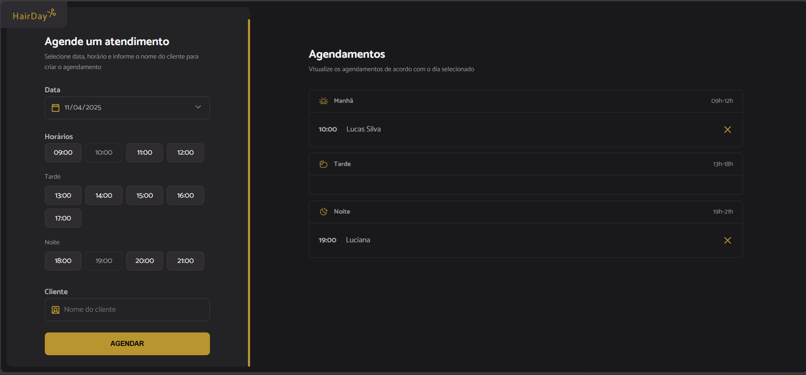

# Projeto Hairday

Pagina web responsiva desenvolvida durante o primeiro módulo do curso MBA FullStack - Rocketseat + Faculdade Sirius

## Tech Stack

**Client:** HTML, CSS, Mobile Ready, Javascript, Webpack, Babel, Json-server

## Features

- JavaScript for dynamic content rendering, along with Babel for better browser compatibility — all bundled for distribution with Webpack.

## Screenshots

## Authors

- [@marcionavas](https://github.com/marcionavas)

## Acknowledgements

 - [Rocketseat](https://rocketseat.com.br)
 - [Faculdade Sirius](https://faculdadesirius.edu.br/)